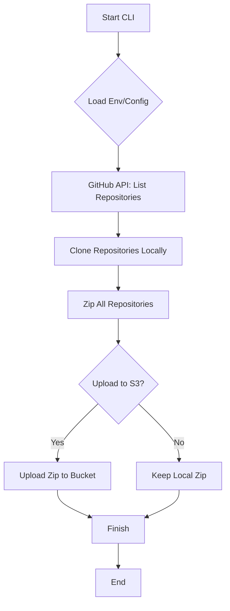

# GBackUp 🚀

GBackUp is a lightweight, secure, and automated CLI tool designed to backup all your GitHub repositories to an S3-compatible storage provider (like Tigris or AWS S3). It clones your repositories, archives them into a single zip file, and uploads them for safe-keeping.

## Table of Contents
- [Features](#features)
- [🛠 Prerequisites](#-prerequisites)
- [🚀 Getting Started](#-getting-started)
- [📖 Usage](#-usage)
- [📊 How it Works](#-how-it-works)
- [📂 Project Structure](#-project-structure)
- [🛡 Security](#-security)
- [📝 License](#-license)

## Features

- **Automated Cloning**: Fetches all repositories you own (including private ones).
- **Secure Archiving**: Compresses all cloned repositories into a timestamped ZIP file.
- **S3 Integration**: Automatically uploads your backup to S3-compatible storage.
- **Flexible Options**: Support for public-only backups, local-only backups, and custom output directories.
- **Beautiful CLI**: Real-time progress tracking with a modern interface.

---

## 🛠 Prerequisites

- Python 3.8+
- Git installed on your system.
- A GitHub Personal Access Token (PAT).
- S3-compatible storage credentials (Access Key, Secret Key, Bucket Name, and Endpoint URL).

---

## 🚀 Getting Started

### 1. Clone the Repository

```bash
git clone https://github.com/yourusername/GBackUp.git
cd GBackUp
```

### 2. Install Dependencies

```bash
pip install -r requirements.txt
```

### 3. Environment Setup

Create a `.env` file in the root directory and add your credentials:

```env
GITHUB_ACCESS_TOKEN=your_github_token
TIGRIS_ENDPOINT=your_s3_endpoint_url
BUCKET_NAME=your_bucket_name
ACCESS_KEY=your_access_key
SECRET_KEY=your_secret_key
```

---

## 📖 Usage

Run the backup process using the `main.py` entry point:

```bash
python main.py backup [OPTIONS]
```

### Options

| Flag | Description | Default |
| :--- | :--- | :--- |
| `--token` | GitHub Personal Access Token (overrides `.env`) | From `.env` |
| `--org` | Backup repositories from a specific organization | `None` |
| `--public-only` | Backup only public repositories | `False` |
| `--no-upload` | Skip upload to S3 (keeps the backup locally) | `False` |
| `--output-dir` | Specify a custom local directory for the ZIP file | `temp_backups/` |

### Examples

**Standard Backup:**
```bash
python main.py backup
```

**Organization Backup:**
```bash
python main.py backup --org MyOrganizationName
```

**Local-only Backup (Public Repos):**
```bash
python main.py backup --public-only --no-upload --output-dir ./my_backups
```

---

## 📊 How it Works

The following flowchart describes the internal logic of GBackUp:



---

## 📂 Project Structure

- `main.py`: Entry point for the CLI.
- `gbackup/`: Core logic and providers.
  - `cli.py`: Command-line interface definitions.
  - `core/`: Backup service and interfaces.
  - `providers/`: GitHub and S3 integration.
  - `utils/`: Archiving and helper functions.
- `requirements.txt`: Python dependencies.

---

## 🛡 Security

- **No Secrets in Code**: GBackUp uses `.env` files and environment variables to handle sensitive data.
- **Clean Up**: Temporary cloned files are automatically removed after the ZIP is created to save space and ensure security.

---

## 📝 License

Distributed under the MIT License. See `LICENSE` for more information.
